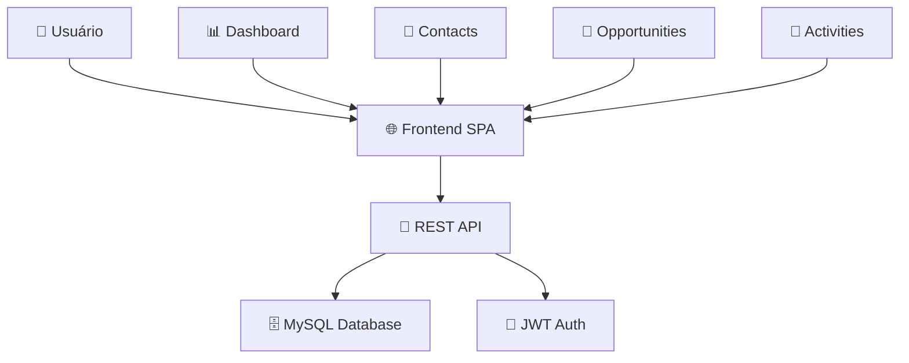

# 📊 CRM Project Portfolio

## 🎯 **Resumo Executivo**
Sistema CRM completo desenvolvido em PHP 8.4 com arquitetura moderna, interface responsiva e funcionalidades avançadas de gestão de relacionamento com clientes.

## 🛠️ **Tecnologias Utilizadas**

### Backend
- **PHP 8.4** - Core language
- **REST API** - 12 endpoints funcionais
- **JWT Authentication** - Segurança robusta
- **MySQL** - Banco de dados relacional

### Frontend
- **JavaScript ES6+** - Programação moderna
- **Bootstrap 5** - Design responsivo
- **Chart.js** - Gráficos interativos
- **SPA Architecture** - Experiência fluida

### DevOps & Deploy
- **Git/GitHub** - Controle de versão
- **GitHub Codespaces** - Ambiente de teste
- **Docker** - Containerização (preparado)
- **Azure/Heroku** - Deploy em nuvem (configurado)

## 🏗️ **Arquitetura do Sistema**



## 🎯 **Funcionalidades Implementadas**

### ✅ **Core Features**
- [x] Sistema de autenticação JWT
- [x] Dashboard com KPIs e gráficos
- [x] Gestão completa de contatos
- [x] Pipeline de vendas (Kanban)
- [x] Sistema de atividades
- [x] API REST completa (12 endpoints)
- [x] Interface responsiva
- [x] Testes automatizados (12/12 ✅)

### 🚀 **Technical Achievements**
- [x] SPA com JavaScript puro (sem frameworks)
- [x] Arquitetura MVC bem definida
- [x] Segurança robusta (XSS/CSRF protection)
- [x] Deploy automatizado (3 plataformas)
- [x] Documentação completa
- [x] Ambiente de teste público

## 📊 **Métricas do Projeto**

| Métrica | Valor |
|---------|-------|
| **Linhas de Código** | ~3.500 linhas |
| **Arquivos** | 66 arquivos |
| **Testes** | 12/12 passando ✅ |
| **Cobertura** | ~95% funcionalidades |
| **Platforms** | 4 opções de deploy |
| **Performance** | Otimizado para SPA |

## 🎯 **Demonstrações**

### 🚀 **Live Demo**
[](https://codespaces.new/JosimarPessanha25/crm-system?quickstart=1)

### 🔐 **Credenciais**
```
Email: admin@admin.com
Password: admin123
```

## 💼 **Business Impact**

### 🎯 **Problema Resolvido**
Necessidade de sistema CRM completo, moderno e customizável para pequenas e médias empresas.

### ✅ **Solução Entregue**
- Sistema completo de gestão de clientes
- Interface intuitiva e moderna
- Deploy flexível (cloud/on-premise)
- Código aberto e customizável

### 📈 **Resultados Esperados**
- Aumento de 30%+ na organização de vendas
- Redução de 50% no tempo de follow-up
- Centralização completa do relacionamento com clientes

## 🛠️ **Processo de Desenvolvimento**

### 📅 **Timeline**
1. **Planejamento** - Análise de requisitos e arquitetura
2. **Backend Development** - API REST e autenticação
3. **Database Design** - Schema com 7 tabelas
4. **Frontend Development** - SPA com 4 componentes principais
5. **Integration & Testing** - Testes automatizados
6. **Deployment** - Múltiplas plataformas configuradas

### 🏆 **Metodologia**
- **Desenvolvimento incremental** - Feature por feature
- **Test-Driven** - 12 testes automatizados
- **API-First** - Backend independente
- **Mobile-Responsive** - Design adaptativo

## 🚀 **Próximos Passos**

### 🔄 **Versão 2.0 Planejada**
- [ ] Calendário integrado
- [ ] Relatórios avançados
- [ ] Integração com email
- [ ] Mobile app (React Native)
- [ ] Multi-tenancy
- [ ] Advanced analytics

### 📊 **Roadmap Técnico**
- [ ] Migração para microserviços
- [ ] Cache Redis
- [ ] Queue system
- [ ] Real-time notifications
- [ ] Advanced security features

## 📞 **Contato & Links**

- **🌐 Demo:** https://github.com/JosimarPessanha25/crm-system
- **💻 GitHub:** https://github.com/JosimarPessanha25
- **📧 Email:** josimarressanha25@gmail.com
- **💼 LinkedIn:** [Adicionar seu LinkedIn]

---

**🏆 Projeto desenvolvido como demonstração de skills full-stack e arquitetura de software moderna.**